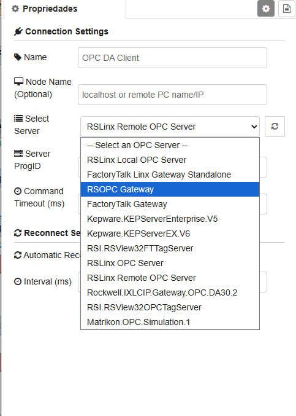
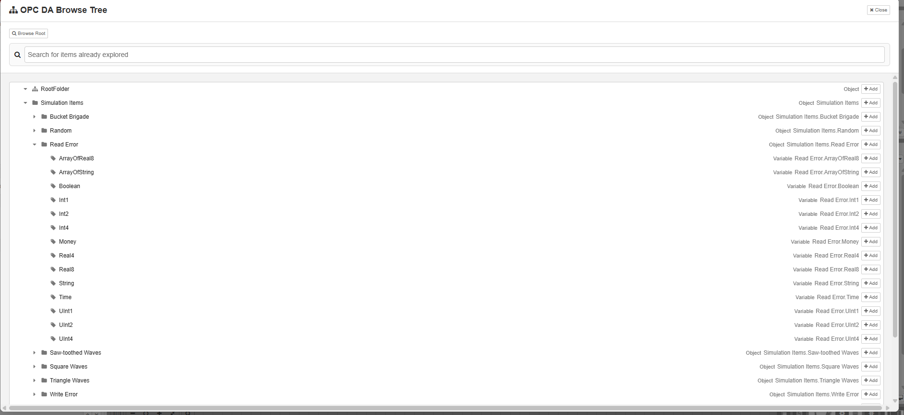

A lightweight wrapper for OPCDAAuto.dll that brings classic OPC DA connectivity to Node-RED. A C# background worker handles COM operations through a persistent asynchronous stdin/stdout

## Prerequisites

OPC DA is a legacy Windows-only technology built on COM/DCOM architecture. To use these nodes, you must satisfy the following requirements:

**Operating System**: Windows (Windows 7/10/11, Windows Server, etc.)

**register OPCDAAuto.dll(If a notification hasn't been set up, a prompt to register will appear upon the first login.)**

It is recommended to run Node-RED on the same machine as the OPC DA server.

## Main Features

- **Persistent Connection Management**: Spawns a single, shared background C# instance per OPC server connection to keep resource usage minimal.
- **Dynamic Server Discovery**: Automatically queries and displays all installed local or remote (via DCOM) OPC DA servers in a dropdown selection.
- **Read Mode**: Performs fast synchronous batch tag reads, returning values, quality codes, and ISO timestamps.
- **Write Mode**: Support writing typed values (Int16, Int32, Float, Double, Boolean, String, etc.) to OPC DA variables.
- **Browse Mode**: Features a tree explorer UI in the editor configuration modal to browse tags and folders dynamically.
- **Browse Recursive Mode**: Automatically walks folder hierarchies recursively, gathers all child leaves, and returns a fully populated nested tree containing all read tag values.
- **Subscription Mode**: Subscribes to real-time value changes on selected groups of tags, emitting change events immediately.
- **Configurable Command Timeouts**: Fully parameterizable command execution timeout to avoid flow blocks during slow DCOM network reads.

## Node Configurations

### 1. Connection Configuration (`opcda-client-config`)
- **Node Name (Optional)**: Specifies the computer name or IP address of a remote DCOM host. If left empty, discovery and connection are performed on the local machine.
- **Select Server**: A dropdown list with a refresh button to scan and choose registered OPC DA servers.
- **Server ProgID**: The exact programmatic identifier of the OPC server (e.g. `Matrikon.OPC.Simulation.1`, `Kepware.KEPServerEX.V6`).
- **Command Timeout (ms)**: Adjustable timeout (in milliseconds) for execution commands.

### 2. Client Node (`opcda-client`)
- **Mode**: Choose between `Read`, `Write`, `Browse`, `Browse Recursive`, and `Subscription`.
- **Browse Tree**: Click to open a visual explorer modal supporting folder expansion, Ctrl + click multi-selections, and instant `itemID` copying.
- **Update Rate (ms)**: Available in subscription mode to control polling check frequency.

### Client config

### Client Editor

### Support the Project
If you find this project useful, please support its development:

[@vitormnm](https://vitormiao.com/)

